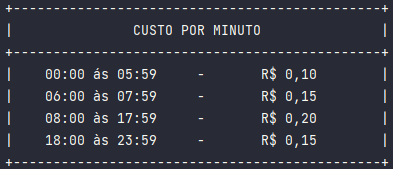

# TempoDeLigacao
<h2>Um programa focado em converção de String para Int</h2>

**_Funciona da seguinte forma :_** 
> O usuário digita o horário de inicio da chamada no formato (hh:mm) que é recebido em forma de String, depois é solicitado o horario final da chamada.
No final do programa mostra quantos minutos durou a chamada, quantos centavos por minutos de acordo com a tabela abaixo, e o valor total da chamada.  
 
Criei metodos para pegar parte das Strings e transformar em int para poder fazer o calculo, e outros metodos para fazer o calculo e exibir na tela.
